# Cascade Debt Technical Task

This is a dbt project that does the following:

1. Extracts data from 8 field-report sheets.
2. Cleans and conforms them into single data dictionary.
3. Normalizes them into BCNF star schema.
4. Answer four analytical questions for the Interpol team.

## Quickstart

Run every step with `docker compose`.

```bash
# 1. Build the dbt image
docker compose build

# 2. Start Postgres in the background
docker compose up -d db

# 3. Install dbt packages (dbt_utils)
docker compose run --rm dbt deps

# 4. Load the seed CSVs
docker compose run --rm dbt seed

# 5. Run all models in DAG order
docker compose run --rm dbt run

# 6. Run the data tests
docker compose run --rm dbt test
```

Steps 4-6 can be run together by `docker compose run --rm dbt build`.

## Documentation

Generate and serve the dbt docs site with `docker compose`.

```bash
# 1. Build the catalog/manifest artifacts
docker compose run --rm dbt docs generate

# 2. Serve the docs site on http://localhost:8080
docker compose run --rm --service-ports dbt docs serve --host 0.0.0.0 --port 8080 --no-browser
```

Then open `http://localhost:8080` in your browser.

If port 8080 is already taken on your machine, publish the docs on a different host port by setting `DBT_DOCS_PORT` before the second command, e.g.:

```bash
DBT_DOCS_PORT=8081 docker compose run --rm --service-ports dbt docs serve --host 0.0.0.0 --port 8080 --no-browser
```

and open `http://localhost:8081` instead.

## Data Pipeline Diagram

1. `carmen_sightings.xlsx`
2. `src.raw_sightings_*`, for America, Africa, Asia, Australia, Atlantic, Europe, Indian, Pacific
3. `stg.stg_sightings_*`, for America, Africa, Asia, Australia, Atlantic, Europe, Indian, Pacific
	- From `src` to `stg`, the raw data is cleaned using the `standardize`  macro, which aligns the column names and data types.
4. `int.int_sightings` is an ephemeral intermediate table, which combines all the `stg` table into a giant 1NF table that is wide and deep.
5. `mart` contains the star schema:
	- `dim_*` or dimension tables normalize the schema into properties, for agency, agent, attribute (what they carry), behavior, location, temporal (date of sighting), witness.
	- Note however that `dim_attribute` is a *junk dimension*, because it bundles together `has_weapon`, `has_hat` and `has_jacket` which are three independent booleans that describe what is carried. They are not important enough to have their own independent dimension tables, so they are rolled up into a single lookup table.
	- `fact_sightings`  is the central fact table that has foreign keys to conformed dimensions listed above.
6. `analytics.XYZ` tables contain answers to the questions prompted.
	- `analytics_region` answers (a) for each month, which agency region is Carmen San Diego most likely to be found in?
	- `analytics_attribute` answers (b) for each month, what is the probability Ms Sandiego is armed and wearing a jacket but not a hat?
	- `analytics_behavior` answers (c) what are the three most occurring behaviors of Ms Sandiego?
	- `analytics_common_behavior` answers (d) for each month, what is the probability Ms Sandiego exhibits one of her three most occurring behaviors (which is taken from (c))?


## Step 1. Extraction
`scripts/extract_.py` is used to write one CSV per sheet, which forms the data to seed the dbt process.

Note that:

* Headers are preserved as they are.
* Each column is converted to `varchar` datatype.

### Header titles are preserved
This includes column names such as ‘armed?’ or non-Latin characters such as ‘报道’. I preserved the header titles because renaming during the extraction would violate the data flow. The function of the extraction layer in ETL is to produce a faithful *copy* of the source data.

The seed data is then configured using `quote_columns: true` to escape any strings which may cause issues when reading them later.

### Columns are converted to `varchar` only
Similarly, any type conversion would violate the data flow. At the extract stage, we do not need to infer types or do any type casts as the objective is to preserve a copy of the source data.

## Step 2. Conformation
After examining the data, it was found that each agency has the same underlying data dictionary, but uses their own versions of headers. The following mapping table shows the differences in terminology.

| - | EUROPE | ASIA | AFRICA / AMERICA / ATLANTIC / INDIAN | AUSTRALIA | PACIFIC |
|---|---|---|---|---|---|
| `date_witness` | `date_witness` | `sighting` | `date_witness` | `witnessed` | `sight_on` |
| `witness` | `witness` | `citizen` | `witness` | `observer` | `sighter` |
| `agent` | `agent` | `officer` | `agent` | `field_chap` | `filer` |
| `date_agent` | `date_filed` | `报道` | `date_agent` | `reported` | `file_on` |
| `city_agent` | `region_hq` | `city_interpol` | `region_hq` | `interpol_spot` | `report_office` |
| `country` | `country` | `nation` | `country` | `nation` | `nation` |
| `city` | `city` | `city` | `city` | `place` | `town` |
| `latitude` | `lat_` | `纬度` | `latitude` | `lat` | `lat` |
| `longitude` | `long_` | `经度` | `longitude` | `long` | `long` |
| `has_weapon` | `armed?` | `has_weapon` | `has_weapon` | `has_weapon` | `has_weapon` |
| `has_hat` | `chapeau?` | `has_hat` | `has_hat` | `has_hat` | `has_hat` |
| `has_jacket` | `coat?` | `has_jacket` | `has_jacket` | `has_jacket` | `has_jacket` |
| `behavior` | `observed_action` | `behavior` | `behavior` | `state_of_mind` | `behavior` |

At first, I wrote three identical `SELECT` lists. However, after refactoring the code, I created a macro to handle the standardization of the headers. This is found in `dbt/macros/standardize.sql`. After that, all `stg` tables would call the `standardize` function while providing a mapping dictionary.

This has two advantages:

1. *Extensibility*. If the model adds new details in the future, I will change the macro and then subsequently add the mapping to each of the existing models in a clearer way.
2. *Modularity*. The standardization function does only the work of standardizing, while the `stg` files do the work of defining the mapping table. This makes the separation of concerns clearer.

### Truthiness
I observed that there were different linguistic equivalences for `true` and `false`, provided in different languages. An example would be: ‘是’ and ‘ja’ both meaning `true`.

Refactoring further, I created the `to_boolean` function to convert these texts into a boolean variable, instead of leaving them as `char`  types.

There was also some confusion over the term ‘NA’. However, because it is a varchar, it did not raise any errors. The term ‘NA’ in this sense refers to Namibia, and not “N/A” as in not applicable, which ordinarily would be converted to the `NULL` value.

## Step 3. Normalizing beyond 1NF
The `stg` tables are all 1NF. Each row in the table repeats the witness’ name, agent’s name, HQ city, country, city, coordinates (latitude, longitude) and behavior.

## Entity-Relationship Diagram
The Carmen project has a star schema:

- Source
- Staging
- Intermediate (ephemeral table)
- Mart
- Analytics

The entity-relationship diagram is as follows.



### Generating the diagram

```bash
# 1. Regenerate the manifest so it reflects the current relationships tests
docker compose run --rm dbt docs generate

# 2. Install dbterd (a local Python CLI, not a dbt package)
pip install dbterd

# 3. Render the mart-layer star schema as a Mermaid ER diagram
cd dbt
python -m dbterd run -t mermaid --artifacts-dir target -s "schema:mart" -o . -ofn erd.md
```